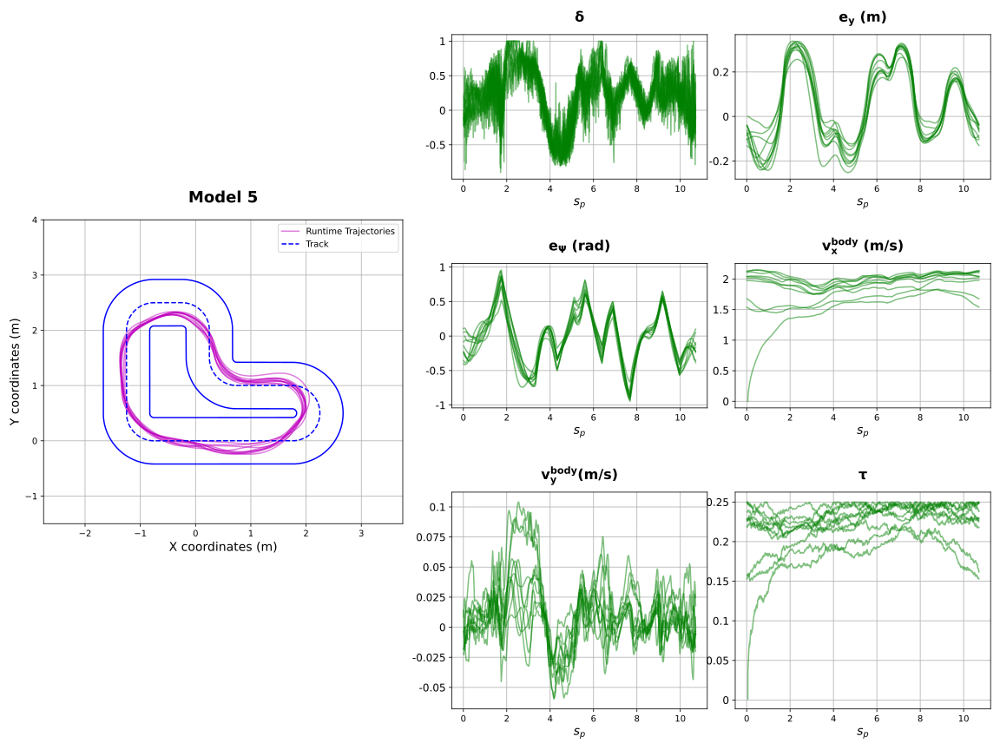

# Imitation Learning for Driving Control

We explore various methods to augment the data set and different training strategies to improve the performance of the model, particularly focusing on where to add data points so that their effect remains minimal with respect to imitating the expert and does not introduce new behaviors. We present the results of these approaches by evaluating them on a miniature race car, predicting the throttle and steering inputs to control the car. The impact of different data augmentation techniques and training methods is compared to assess their effectiveness. Finally, the learned neural network controller is deployed in both a simulation and a real miniature car, demonstrating the success of the approach in real-world settings.


##  Data Preprocessing: 

``` src/preprocessing/```

1. Convert .mcap files to csv files with ```1_mcap_to_csv_for_all.py```.
2. Clean up the .csv files and save as "Cleaned_()" (convert timestamp and extract data, by dismissing message information) with ```2_cleanup_csv.py```.
3. Preprocess the data with ```3_preprocess_data.py```.

It generates the datasets to be used in training using the raw data coming from the mocaps. The raw data and the cleaned data can be found in ```data_la_human_expert/```.


## Project Datasets Directly Recorded in ".feather":

``` data/```

These include all the recorded datasets from experiments, the original datasets, the augmented datasets, and all the added points in the data augmentation in ".feather" format.

- ```experiment_sim/```: datasets obtained by simulating the car with NN policy 
- ```expert/```: contains original expert datasets (human and pure pursuit)
- ```expert_added_points/```: contains artificially added datapoints only
- ```expert_augmented/```: contains original dataset + added datapoints
- ```expert_bucket_data/```: contains the mean and std data for each individual bucket in original trajectories, and the mean trajectory of human dataset

The human-generated dataset is stored in the file **"all_trajectories.feather", and "all_trajectories_filtered.feather"**, while the controller-generated dataset is in **"pure_pursuit_artificial_df.feather"**. The `.feather` file format is used for efficient data loading.

To load the data, you can use the following Python command:

```python
import pandas as pd

data = pd.read_feather('Obtained Model Data/all_trajectories_filtered.feather')  # Choose the appropriate dataset to load
```

# Training the models: 

- ```src/data_augmentation.ipynb```: generates artificial datapoints to augment the dataset
- ```src/training_model.ipynb```: trains the model with the specified augmented dataset


## Neural Networks Parameters

```model_config/```

For each neural network, model file and a coefficient file is defined:

- ```model file```: in .pth format. Contains the neural network parameters 
- ```scaling parameters file```: contains the mean and std for the datasets used for training the model
 

## Deployment of the NN Controllers:

```ros2/racecar_nn_controller/```

For the deployment of the trained models, you should copy the ROS2 package `racecar_nn_controller` into your ROS2 workspace. After that, you can build your workspace using `colcon build` to compile all the packages in the workspace. Once the build process is complete, source your workspace by running `source ~/ros2_workspace/install/setup.bash` to set up the environment variables.

Finally, to run the controller node and start controlling the racecar with the trained models, use the following command:

```bash
ros2 run racecar_nn_controller controller_node
```

# Metrics:

```src/comparison/```


- ```ellipsoid_percentage.py:``` Calculates the percentage of sampled runtime points that are outside of their respective confidence ellipsoids
- ```FFT.py:``` Calculates DFT of the steering inputs for different models
- ```interactive_ellipsoid_plot.py:``` Animates the confidence ellipsoids with the real time trajectory progression. Also calculates the number of collisions via ```check_collision.py```
- ```OTT.py:``` Calculates regularized 1-Wasserstein distance with OTT library.


# Visualization of Results

```src/utils```

- ```plot_all_states.py:``` Plots the trajectory and the corresponding state variables, overlapped with respect to lap number.
- ```plot_individual_states.py:``` Plots the individual state variables 
- ```plot_overlayed.py:``` Plots the trajectories overlayed with the expert trajectories. User needs to specify the wanted model results.
- ```plot_results.py:``` Plots the metrics for each model to be compared
- ```plot_track.py:``` Plots the track. The user can input the ax and fig to the function. 





## Results from the Work

All figures can be found in ```figures/```.

[model42.webm](https://github.com/user-attachments/assets/ab6ebf66-2d7d-4e8f-9b16-37f6f99f94d1)


https://github.com/user-attachments/assets/182338bd-fabd-4f37-a1b5-2e7b36c78306


https://github.com/user-attachments/assets/18a563a2-11a7-4fc7-a19c-9a671cfb9809


